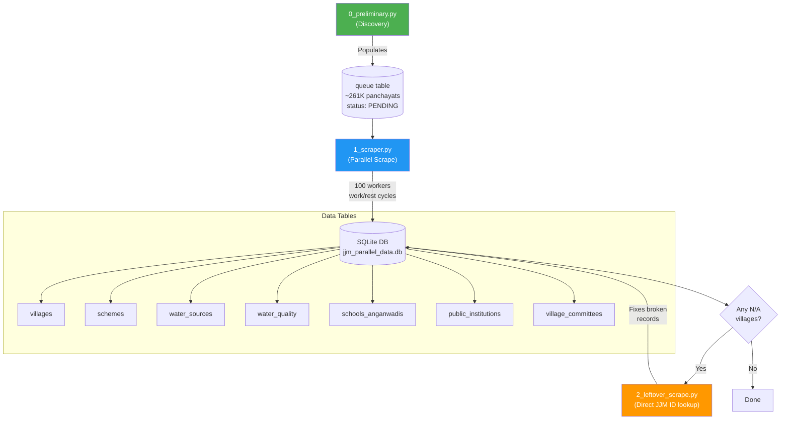

# JJM Village Profile Scraper

Scrapes village-level water infrastructure data from India's [Jal Jeevan Mission (JJM)](https://ejalshakti.gov.in/JJM/JJMReports/profiles/rpt_VillageProfile.aspx) Village Profile page. Covers all ~585K villages across ~261K panchayats, collecting demographics, water schemes, water quality tests, schools/anganwadis, public institutions, and village committee data.

## Process Overview



### Step-by-step

1. **`0_preliminary.py`** - Navigates the ASP.NET dropdown chain (State > District > Block > Panchayat) to discover all panchayats and stores them as PENDING tasks in the `queue` table. Supports safe resume via log tables.

2. **`1_scraper.py`** - Processes PENDING panchayats using 100 parallel workers. For each panchayat, navigates to every village and scrapes its full profile. Uses a dedicated DB writer thread to serialize writes. Runs in 20-minute work / 2-3 minute rest cycles to avoid IP blocking.

3. **`2_leftover_scrape.py`** - Re-scrapes villages that ended up with broken data (all fields N/A) due to network issues. Uses the JJM VillageId direct lookup feature to bypass the dropdown chain entirely. Single-threaded since there are only ~613 villages to fix.

## Database Schema

| Table | Description | Key Fields |
|-------|-------------|------------|
| `queue` | Panchayat task list | state, district, block, panchayat, status |
| `villages` | Village demographics | jjm_village_id, population, tap_connections, lgd_code |
| `schemes` | Water infrastructure schemes | scheme_code, agency, cost, progress, source_type |
| `village_scheme_mapping` | Links villages to schemes | village_id, scheme_code |
| `water_sources` | Habitation-level water sources | source_type, source_location |
| `water_quality` | Water quality test results | test_type, status, test_date |
| `schools_anganwadis` | Schools and Anganwadi centers | type, name, has_tap_connection |
| `public_institutions` | Health centers, govt buildings | name, category, has_tap_connection |
| `village_committees` | Water management committee members | name, gender, designation |

## Setup

1. Create and activate a virtual environment

   ```bash
   # macOS/Linux
   python3 -m venv .venv
   source .venv/bin/activate

   # Windows
   python -m venv .venv
   .venv\Scripts\activate
   ```

2. Install dependencies

   ```bash
   pip install -r requirements.txt
   ```

## Usage

```bash
# Step 1: Build the panchayat queue (run once)
python 0_preliminary.py

# Step 2: Scrape all villages (can be stopped and resumed)
python 1_scraper.py

# Step 3: Fix any broken village records using JJM Village Code (skips dropdowns)
python 2_leftover_scrape.py
```

## Notes

- The scraper targets the ASP.NET Village Profile page and manages ViewState across requests.
- `1_scraper.py` creates automatic database backups during cooldown periods.
- Villages with `V_` prefix IDs (e.g., `V_45620`) are ones where the JJM VillageId couldn't be extracted from the page — typically due to network issues returning empty HTML. These are the targets for `2_leftover_scrape.py`.
- Scheme data is cached across workers to avoid duplicate scraping — the `expected_scheme_count` field on each village can be used to verify completeness.
